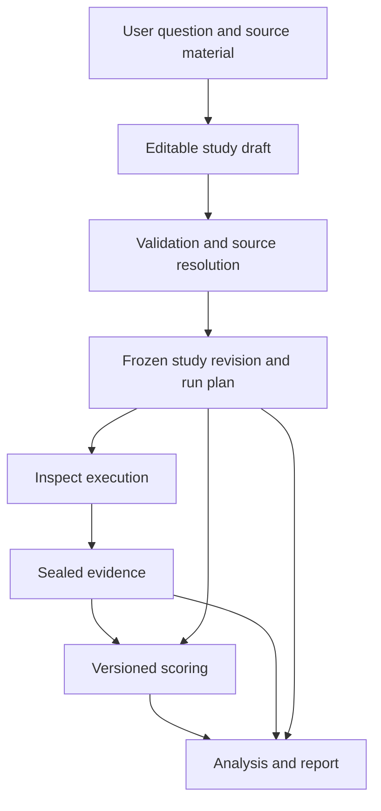
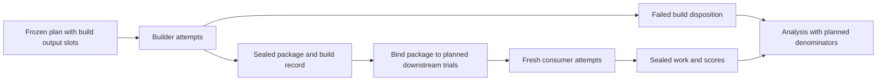

# Architecture

Status: proposed architecture, 2026-09-08. No application code or integrations
described below have been implemented. Proposed paths and record names are a map
for development, not existing APIs. Update this document as those boundaries are
implemented, and replace proposed locations with links to real code.

[SPEC.md](SPEC.md) owns the product requirements and measurement semantics.
[AGENTS.md](AGENTS.md) is the development entry point. This document explains how
the system is divided, how information moves, and which invariants each boundary
must preserve. Its structure follows the user's pinned
[rust-analyzer architecture reference](https://github.com/rust-lang/rust-analyzer/blob/d7c99931d05e3723d878bea5dc26766791fa4e69/docs/dev/architecture.md).

## Bird's-eye view

Yassa turns a user's comparison question into a recorded experiment. Preparation
accepts supplied materials and may use AI to clarify the task, propose a rubric,
and find or construct cases. A resolved study and sampling plan then specify the
work to run through Inspect. Execution produces evidence; scoring and analysis
produce versioned interpretations of it.

The initial implementation is proposed as one Python package using Inspect, with
ordinary module boundaries. A thin programmatic entry point can support a CLI or
an agent-facing interface. The boundaries below do not require separate services
or a separate model agent for each responsibility.



The diagram shows information dependencies. It does not require a separate
process for every box or delay all scoring until every trial has completed.
Scoring can happen as soon as the required evidence for an attempt is sealed.

The ground records are the resolved conditions and observed work. Scores,
statistics, and reports refer to those records and can be regenerated under an
explicitly identified procedure. A new procedure produces a new interpretation;
it does not rewrite the work that happened.

**Architecture invariant:** AI-assisted preparation can revise a draft. It cannot
silently revise the conditions of a running experiment.

**Architecture invariant:** a report's numerical claims originate in recorded
scores and analysis. Report generation does not invent measurements or decide
which unsuccessful attempts disappear.

## Repository map

The current relevant tree, including this document, is:

```text
yassa/
|-- AGENTS.md          Development entry point and repository index
|-- ARCHITECTURE.md    Proposed components, boundaries, and invariants
|-- README.md          Project orientation and document navigation
|-- SPEC.md            Working requirements and open product decisions
`-- STARTDEV.md        Kickoff prompt for the first implementation context
```

The following is a **proposed** source layout. None of these directories is
created by this document. Start components as small modules where practical;
split them when their responsibilities need separate code or guidance.

```text
src/yassa/
|-- app.py             Application entry points and stage orchestration
|-- study.py           Study records, identities, and structural validation
|-- prepare/           Guided drafting, supplied inputs, and case discovery/construction
|-- templates/         Versioned task contracts and template resources
|-- planning.py        Sampling allocation and logical trial plans
|-- sources.py         External source resolution and verification
|-- contexts.py        Role-specific input manifests and execution bindings
|-- execution/         Inspect integration and supported agent adapters
|-- evidence.py        File capture, manifests, and durable attempt records
|-- scoring/           Deterministic checks and explicit grading interfaces
|-- analysis/          Paired/grouped estimates and sensitivity calculations
`-- reporting.py       Reports and evidence indexes
studies/               Shareable study definitions and source references
tests/                 Contract, boundary, integration, and analysis fixtures
```

External source checkouts, private datasets, submitted packages, logs, and run
artifacts live under configured roots outside the yassa source repository.
`studies/` contains references and shareable configuration, not vendored Dovetail
packs. Template resources are yassa-owned guidance and fixtures.

Keep the current tree in the root agent guide short. Link from each implemented
area to deeper explanations or a scoped `AGENTS.md` only when work in that area
needs distinct instructions. Navigation follows the task rather than requiring
every agent to read every document.

## Component map and API boundaries

### `study.py`: the language of a study

This module owns versioned records and structural rules shared across the
application. It defines what a study, trial, artifact reference, score, and
analysis result mean without depending on Inspect object layouts.

The records below are proposed interface concepts. Their exact Python types and
serialized fields are established with the first implementation.

| Record | Purpose and ownership |
| --- | --- |
| `StudyDraft` | Editable requirements, intended use/evidence needs, supplied facts, assumptions, proposed choices, and unresolved questions; owned by preparation or an expert caller |
| `StudyRevision` | Resolved conditions including input preparation, source/provenance identities, task/scoring/analysis policies, and schema versions; immutable once frozen |
| `RunPlan` | Planned logical trials, dependency slots, pairing/group IDs, allocation, order, and stopping/budget policy |
| `TrialSpec` | One planned build or task execution, including its role, treatment, conditions, and upstream artifact slots |
| `ExecutionBinding` | Exact input/artifact hashes and role context used for one attempt, including resolved upstream outputs |
| `AttemptRecord` | One execution attempt, its status, usage, raw-log references, and evidence; retries link to prior attempts |
| `ArtifactRef` | Content identity, manifest, provenance references, media/type information, and storage locator for preserved files |
| `ScoreRecord` | Scorer revision, evidence references, component values, grading provenance, and result/missingness status |
| `AnalysisRecord` | Input score/attempt selection, plan revision, weighting, estimates, uncertainty, and supported scope |

This is an **API boundary**: preparation, execution, and reporting exchange these
records rather than each other's internal state.

**Architecture invariant:** study records contain explicit values and references.
Their meaning does not depend on a process's working directory, ambient model
configuration, or mutable global state.

**Architecture invariant:** the core record and validation module performs no
network, filesystem, subprocess, or model I/O. External checks return evidence
that the application supplies to it.

### `prepare/` and `templates/`: from intent to a usable draft

Preparation implements the guided path in
[SPEC section 3](SPEC.md#3-helping-the-user-define-a-study). Rubric Builder and
Dataset Finder are capabilities here. They can share one assistant session or be
ordinary callable operations; the architecture does not prescribe a fixed agent
team.

Preparation assesses supplied information before asking for more. It can accept
a complete request directly or ask one or two material follow-up questions at a
time. It records the intended use of the result and proposes the simplest study
that serves it, with stronger evidence requirements where the use calls for them.
Questioning stops once the chosen study can be defined. Users can revise the
proposal without having to author tasks, examples, or an analysis plan themselves.

Templates supply task-specific variables, success contracts, example evidence,
checker interfaces, grouping/split guidance, and declared limitations. Discovery
returns candidate case manifests with provenance and suitability information.
The user or preparation process can select and revise those candidates.

Supplied and Yassa-prepared materials converge on the same resolved-input
interfaces. Preserve supplied originals and link adapted or generated files to
their source artifacts and preparation records. Record the preparation condition
separately from authorship, synthetic origin, and completeness. Mixed material
retains those facts per artifact. Both routes use the same readiness checks.

Synthetic construction also belongs to preparation. It returns preserved task
and example files, reference/checker candidates, generation provenance, explicit
scenario assumptions, and development/evaluation group assignments. Reference
verification feeds readiness checks; generated answers are not automatically
accepted. These outputs become resolved inputs before execution, so neither
planning nor an evaluated builder invents its own hidden evaluation cases.

Preparation may use external research, model calls, and source-reading tools
through explicit services. Its prompts and intermediate proposals are development
evidence, not automatically inputs to the evaluated subject.

An expert may supply a complete draft directly. Both entry paths pass through
the same structural, source, context, and supported-analysis checks before a run.
The selected analysis may be descriptive; requiring supported methods does not
require an inferential method for every trial. Study-preparation assistance is
kept separate from any declared condition measuring the builder's clarification.

**Architecture invariant:** a suggested rule or generated answer key retains its
provenance and verification status. AI authorship does not make it ground truth.

**Architecture invariant:** a template cannot silently select a business rule,
change a user's intended outcome, or encode an expected winning treatment.

**Architecture invariant:** preparing a derivative never overwrites its supplied
source or erases how the final study inputs were obtained.

### `planning.py`: allocate compute and enumerate work

Planning consumes the resolved study, available case/group manifests, explicit
budget information, and any identified pilot statistics. It produces allocation
alternatives and, once selected, a logical trial plan.

Descriptive plans do not require a power target or a separate pilot. They still
declare counts, pairing where used, resource bounds, and score denominators.
Additional sensitivity planning follows the study's recorded evidence needs.

It preserves separate dimensions for input-preparation conditions, briefs,
builds, downstream tasks, execution repeats, models, and domains. Related input
versions retain their problem-group association. Pairing identifies shared
conditions across arms; it does not assert that two providers' random seeds are
equivalent. Required conditions receive explicit planned counts, so a plan for
both preparation routes cannot silently omit one.

Planning and analysis share versioned method descriptions for supported designs.
The planner asks the method for sensitivity under stated assumptions; it does not
substitute a generic sample-count formula for a builder hierarchy. Unknown cost
or variance inputs remain unknown or appear as explicit scenarios.

The initial path uses fixed plans. Pilot-driven changes produce a new plan.
Sequential scheduling is an extension only after a compatible analysis and
stopping method have been validated.

**Architecture invariant:** planning is deterministic for the same resolved
inputs, algorithm version, and recorded randomization seed. It does not make
model calls or fetch additional cases during plan enumeration.

**Architecture invariant:** a budget estimate and a planned repetition are not
observed usage or a completed attempt.

### `sources.py`: resolve external materials

Source resolution is an I/O boundary for packs, dependencies, datasets, and
supporting resources. It accepts source references and returns verified local
materializations plus revision and content manifests.

For a Git source, record the supplied reference, resolved commit, and the actual
file manifest. A tagged checkout with local edits is not the tagged source.
Detect the mismatch and require an explicitly identified source revision rather
than labeling modified content as the pinned release. Resolve declared
dependencies with the same provenance rules.

Once frozen, execution uses those resolved materials rather than refreshing a
branch or tag. Runtime hosts and model configurations have separate identities;
a pinned pack cannot make an unversioned provider alias immutable.

**Architecture invariant:** no resolver puts Dovetail source text inside the
yassa repository. Any run log reproducing that text also belongs in external
evidence storage.

### `contexts.py`: decide what an actor receives

Context assembly projects the full study into role-specific manifests. It
resolves only the inputs allowed for the current actor and records an
`ExecutionBinding` before that attempt is released to execution.

A manifest includes rendered instructions, file mappings, available tools,
configuration, service state, and output locations. The subject is not given the
full study revision, all metadata, or the complete run directory merely because
these are available to the controller.

For pack comparisons, common prompt segments and task files are assembled once
per matched condition, including its input-preparation condition. Only the
declared treatment segment varies within that match. Native hosts can add their
own material; the adapter records those additions and verifies the comparison's
intended equality at the boundary it can observe. Preparation history remains
controller evidence unless explicitly declared as a subject input.

This is an **API boundary** between experiment definition and execution.
`execution/` materializes the manifest; it does not improvise extra instructions.

**Architecture invariant:** metadata is not a security boundary. Protected
material stays outside every subject-accessible filesystem, service, and tool
path, even when it is absent from the initial prompt.

**Architecture invariant:** downstream input binding can fill a declared artifact
slot. It cannot change task selection, budgets, or the scoring contract.

### `execution/`: use Inspect to perform attempts

Execution profiles are selected per stage as described in
[SPEC section 11.1](SPEC.md#111-execution-routes). API-only profiles use Inspect's
model interface; common-workbench profiles use an Inspect agent loop; native
profiles launch a pinned CLI in the trial sandbox. Codex CLI and Claude Code are
intended native targets. Profile selection is part of the study conditions.

The Inspect adapter maps ready `TrialSpec` records and execution bindings into
Inspect tasks, samples, agents/solvers, sandbox setup, scoring hooks, and logs.
Inspect handles model execution and its supported concurrency/retry facilities.
`app.py` connects the study stages and releases downstream work when dependencies
are satisfied; it does not introduce a second general-purpose job scheduler.

The integration boundary records the mapping among yassa trial/attempt IDs and
Inspect task, sample, epoch, and log identifiers. It converts framework output
into yassa evidence records while retaining the original Inspect logs.

Agent adapters declare what they support: explicit loading or native discovery,
host configuration control, tool access, internal-agent accounting, captured
transcripts, and output collection. Unsupported conditions are identified before
launch. A declared adaptation is part of the treatment identity.

Inspect supports native agents and external agents through
[Agent Bridge](https://inspect.aisi.org.uk/agent-bridge.html). Using a bridge does
not establish that all of a CLI's configuration, auxiliary calls, or local tool
effects have been captured; that is verified for each supported adapter.

**Architecture invariant:** the adapter does not automatically load the developer's
home configuration, installed personal skills, repository instructions, or
credentials into the subject context. Required model access is provided through
the declared integration.

**Architecture invariant:** an Inspect completion, an artifact being present,
and a successful task score are separate facts.

### `evidence.py`: preserve what happened

Evidence storage accepts files and records from explicit producers, verifies
their identity, and returns durable references. It owns collection, sealing,
lookup, and export of evidence; it does not decide whether task work is correct.

The proposed initial backend is a local filesystem under an explicitly configured
external run root. Use versioned JSON manifests/records and preserve native
Inspect logs in their original format. Keep source caches, immutable evidence,
and temporary workspaces distinct. No database or remote object store is required
for the initial path.

Capture exact file bytes with SHA-256 hashes and retain relative paths and
relevant executable metadata. Version the manifest serialization used for
record identity. References separate content identity from its current storage
location. Relocating a file does not change its content identity.

Stop or otherwise quiesce subject writes before sealing outputs. Reject path
escapes and undeclared external dependencies during ingestion; link support must
be explicit. Publish the completed manifest only after all referenced files are
durable. A partially written directory is not a reusable completed artifact.

This is an **API boundary** for all stages. The initial single-controller writer
serializes committed records; workers use attempt-specific staging locations.
Concurrent writes must not overwrite another attempt's files.

**Architecture invariant:** sealed evidence is immutable through the application.
Retries, corrections, rescoring, and redaction produce additional records or
derivatives. They do not replace originals.

**Architecture invariant:** filesystem hashes establish identity and allow
verification; they do not themselves enforce access control or immutability.

### `scoring/`: interpret a bounded evidence packet

Scoring consumes a task contract, a scorer revision, protected reference material,
and the evidence packet allowed for that score. It returns component values,
diagnostics, evidence references, and an explicit grading method/status.

Deterministic checks operate on preserved data. Where a check executes submitted
code, a separate verifier sandbox runs that code through a bounded interface;
the trusted scorer retains the expected values/assertions. Do not import a
submitted module into the privileged scorer process. The adapter must state and
enforce the oracle boundary required by that task.

Model grading is an explicit effectful interface. It receives only the declared
rubric and evidence projection, with treatment labels obscured where possible,
and uses the required different-family policy. Internal subject evaluations stay
inside the subject workflow and its resource accounting.

The Inspect scoring hook can invoke these interfaces during an evaluation. A
later rescore invokes them against preserved evidence. If a scorer depends on
ephemeral service state, execution must export the necessary snapshot or trace
before teardown; otherwise later rescoring is recorded as unsupported.

**Architecture invariant:** a deterministic label requires a deterministic path
from evidence to value, including extraction and normalization.

**Architecture invariant:** scoring cannot alter submitted work, choose new
trials, or convert missing evidence into a successful result.

### `analysis/` and `reporting.py`: make measured claims

Analysis consumes explicit selections of attempt and score records with a
versioned analysis plan. It owns denominators, paired contrasts, grouping,
weighting, supported uncertainty calculations, and sensitivity summaries. It
returns an `AnalysisRecord`, including the exact record selection and method.

Numerical analysis functions have no model or execution access. Model-derived
judgments arrive as identified score inputs. Unsupported sampling structures
produce descriptive results and an explicit inferential limitation rather than a
fallback interval that assumes independent deployments.

Reporting formats the analysis and evidence index. It may support Markdown and
machine-readable exports first. A later narrative assistant can explain recorded
findings but cannot supply missing scores or recalculate statistics in prose.

Presentation can lead with a compact observed score for a simple trial or expose
a fuller design and analysis for a more demanding study. Both consume the same
recorded evidence and retain links to provenance, case scope, and denominators;
presentation depth does not change the supported claim.

When a study includes both preparation routes, analysis retains builder
comparisons within each condition. Any aggregation across conditions uses
declared weights and preserves the component results.

**Architecture invariant:** raw attempts, execution repeats, generated packages,
and independent sampling groups retain their separate counts throughout analysis.

**Architecture invariant:** the report identifies the actual scorer and analysis
revision. Correcting a score does not erase the original report's lineage.

## Dependency direction

`study.py` supplies shared records and structural validation. Planning and
numerical analysis depend on these records and their own statistical methods.
They do not import the application controller or runtime adapters.

`app.py` composes preparation, resolution, planning, context assembly, execution,
scoring, storage, and reporting. External I/O enters through explicit source,
execution, evidence, preparation-tool, or grading interfaces. Reporting receives
data rather than invoking the runner to fill gaps.

Framework-specific conversion stays at the Inspect integration boundary.
Inspect's types may be used inside that adapter; they are not the persisted study
schema. This allows old evidence to remain interpretable when an integration
changes, without designing a replacement evaluation framework.

## Run lifecycle

### Resolve and freeze

1. Edit a draft through guidance or expert input.
2. Resolve source/data references and check required adapter/scorer capabilities.
3. Select a sampling and analysis plan with explicit resource assumptions.
4. Freeze a study revision and logical run plan; record configuration precedence
   and resolve ambient settings before they become execution conditions.
5. Materialize and record role-specific bindings for ready trials.

Freezing is a state boundary, not an additional permission ceremony. Execution
uses the authorization already supplied by the user.

### Direct comparison

For each planned arm/task/repeat, bind the declared pack and common task inputs,
run a fresh attempt, capture evidence, then score it. Pairing and grouping come
from the plan, not from a heuristic that tries to match filenames afterward.

### Builder comparison



A downstream trial initially references an output slot owned by a particular
logical build trial. The package does not yet have a content hash. When the
declared build/selection policy yields a package, an `ExecutionBinding` records
its hash and the producing attempt. This adds observed information without
mutating the frozen plan.

If the build fails, downstream slots receive an explicit dependency disposition.
No consumer attempt is fabricated. Analysis applies the study's end-to-end
denominator policy, while still reporting that those deployments never ran.

### Attempt state, resume, and retry

A logical trial may have zero or more execution attempts. An attempt records its
launch, completion/error/interruption status, and evidence availability. Scores
have a separate lifecycle because a completed attempt may await a grader or be
rescored later. A wrong answer can be a completed execution.

Resume reconciles the plan, committed attempt records, and retained Inspect logs.
Reuse an already completed logical trial only under the declared policy and when
its binding, conditions, and required evidence match. An unresolved attempt is
marked for recovery or an explicit retry; missing local status is not proof that
the provider performed no work.

Infrastructure retries receive new attempt identities linked to the original.
Provider request retries remain identifiable in available logs. Independent
experimental repeats have different planned repeat identities. Resuming a run
must not turn a failed answer into an unrecorded extra chance.

**Architecture invariant:** there is no claim of exactly-once model execution
across crashes. The system preserves what it can establish and records uncertain
execution or usage explicitly.

## Access and execution boundaries

The trusted controller can resolve full study material. Model-facing roles
receive projections with narrower permissions. A proposed access matrix is:

| Role | Receives | Produces |
| --- | --- | --- |
| Study preparation | User inputs and authorized research/development material | Drafts, candidate cases, rubrics, and verification evidence |
| Controller | Resolved study, sources, protected evaluation material, and run records | Plans, bindings, scheduling decisions, and committed records |
| Builder subject | Assigned pack/dependencies, brief, development cases, and permitted client/tool interfaces | Generated package and development work |
| Consumer subject | Assigned frozen package, current task inputs, and permitted tools/state | Task artifacts and actions |
| Internal subject evaluator | The context subset allowed by the subject workflow | Internal feedback counted as treatment work |
| Final scorer/grader | Required frozen work, contract, reference evidence, and permitted trace | Score records and diagnostics |
| Analysis/reporting | Explicit result selection and permitted evidence | Derived estimates, reports, and exports |

The builder cannot read held-out cases or other builds. A consumer cannot read
builder development notes, other cases, other arms, or final answer keys. Internal
evaluators inherit the subject's access ceiling; a fresh conversation does not
expand it. Service-based client simulators expose answers according to their
declared policy rather than mounting hidden client state in the subject workspace.

Materialize allowlisted inputs into disposable workspaces with controlled home
and configuration locations. Enforce network and service access at the actual
execution interfaces, including model-provider and host-side tools. Containers
alone do not constrain all such access; the
[Inspect sandbox documentation](https://inspect.aisi.org.uk/sandboxing.html)
explicitly distinguishes those paths.

**Architecture invariant:** a role's access claim is supported by the harness and
boundary checks, not by a prompt asking the role to ignore readable files.

## Cross-cutting concerns

### Revisions and serialization

Version study schemas, template contracts, adapters, checkers, statistical
methods, and evidence manifests. Freeze normalized records using a documented,
versioned encoding; hash original files without normalizing away their content.
Keep credential values out of persisted configuration, while retaining the
non-secret settings needed to identify the environment.

A reader either supports a schema version or reports that it cannot interpret
it. Migration writes a derivative with links to the original. Content identity,
storage location, and the identity of an execution attempt are distinct.

### Configuration and resource accounting

Resolve precedence among study settings, application options, environment, and
host defaults before recording the attempt binding. Runtime substitutions or
provider changes are recorded as deviations, not silently absorbed into the
original conditions.

Use Inspect limits where they cover the required activity. The controller also
accounts for the whole study and build-to-deployment dependencies. Internal model
calls, development trials, final grading, and preparation costs carry stage/role
attribution so totals can be reported without double-counting nested spans.
Cache hits and resumed evidence are distinct from fresh independent observations.

Budget admission accounts for in-flight attempts. If an adapter only enforces a
limit after a call completes, report that granularity and possible overrun instead
of promising an exact monetary cap. Exhaustion stops additional work according
to the declared policy and preserves partial evidence.

### Failure handling and cancellation

Keep task failure, infrastructure failure, invalid benchmark input, missing
grade, and missing evidence separate. The controller owns recovery scheduling;
scorers own correctness judgments; analysis owns the declared denominator policy.

On cancellation, stop new launches, terminate or settle active work through the
adapter, and capture available outputs before workspace teardown. A hard crash
can leave incomplete evidence; recovery reports that condition rather than
marking the attempt successful or deleting it.

Checker corrections create a new scoring revision applied consistently to the
affected evidence set. A revised analysis identifies its changes and preserves
previous scores. A request to revise the skill after seeing final results starts
a new development/evaluation revision with the appropriate exposure history.

### Observability and publication

Keep native Inspect transcripts/logs and add yassa's stage, binding, artifact,
correction, and analysis records. Each report row must be traceable to the
supporting attempts. Do not require replaying a preparation conversation to
discover the effective configuration.

Public exports are identified derivatives of private evidence. Export rules
control disclosure, not experimental inclusion: removing sensitive material from
a public bundle must not silently remove a failure from the reported denominator.
Actual publication remains an application action under user authorization.

### Testing at the boundaries

Concentrate tests on observable contracts:

| Boundary | Evidence required before relying on it |
| --- | --- |
| User input to study draft | Both supplied and Yassa-prepared material supported; focused clarification only when needed; originals, assumptions, derivatives, and split provenance retained |
| Draft to frozen plan | Deterministic enumeration, identified missing inputs, correct grouping, stable revisions |
| Sources to materialized inputs | Correct revision/dependency hashes; modified checkouts and path escapes detected |
| Plan to subject context | Common inputs preserved; undeclared files/configuration/keys unavailable through supported tools |
| Build to consumer | Both first-study input conditions covered; exact produced package bound to planned trials; failed dependencies counted without fake executions |
| Attempt to sealed evidence | Partial writes/crashes distinguished; retry and resume preserve original artifacts and identity |
| Evidence to score | Legitimate alternatives accepted, plausible errors rejected, grading provenance and access enforced |
| Scores to analysis | Correct denominators/pairing; supported dependency structures checked against analytical and simulated cases |
| Analysis to report | Numbers, preparation-condition results, declared aggregate weights, and evidence links reproduced without rerunning subjects or adding unsupported conclusions |

Use small deterministic fixtures and simulated providers for most integration
checks. Real-provider smoke runs separately establish that the selected adapters
load the intended context, collect outputs, and account for actual usage. Such
smoke runs do not establish the statistical properties of a substantive study.

No test command or passing integration is established by this document. Add
verified commands to the relevant development guide when implementation exists.

## Inspect integration checkpoints

Inspect is not installed in the Python environment checked for this draft, and
the repository has no dependency pin. Select a release before implementation and
verify its supported behavior. The current official documentation provides the
following integration points:

- [Tasks and setup/cleanup](https://inspect.aisi.org.uk/tasks.html): map logical
  trials to samples and capture required state before sandbox cleanup. Cleanup
  hooks help normal error paths; crash recovery also needs durable evidence.
- [Agent Bridge](https://inspect.aisi.org.uk/agent-bridge.html): integrate supported
  external agents while checking configuration and tool boundaries.
- [Scoring workflow](https://inspect.aisi.org.uk/scoring-workflow.html): separate
  subject generation from later scoring where preserved evidence is sufficient.
- [Eval sets](https://inspect.aisi.org.uk/eval-sets.html): use supported execution,
  resumption, and retry facilities; configure retention of failed logs explicitly.
- [Metrics and reducers](https://inspect.aisi.org.uk/metrics.html): retain raw
  sample/epoch associations and choose reduction according to the study's units.
- [Limits](https://inspect.aisi.org.uk/setting-limits.html): verify coverage and
  enforcement granularity for every accounted model role and adapter.

## Open implementation decisions

The component boundaries above support an initial implementation without
settling every detail. Resolve these in the first implementation work:

1. Python/Inspect dependency versions, packaging, and the first supported runtime.
2. The initial human-editable study format and exact versioned record schemas.
3. The first sandbox backend and supported native/common-workbench adapter.
4. The artifact manifest details, file/link policy, and local recovery protocol.
5. The first task template, deterministic checker, and paired analysis method.
6. The permitted model-grading route for outputs with several producing families.

Start with one direct study path using fixtures, then add one build-to-consumer
path that exercises artifact binding, isolation, failure accounting, and report
lineage. Choose the real study's domains, models, controls, and sampling allocation
through [SPEC section 13](SPEC.md#13-first-dovetail-study-decisions-still-open).
Those choices are experimental configuration, not architectural constants.
